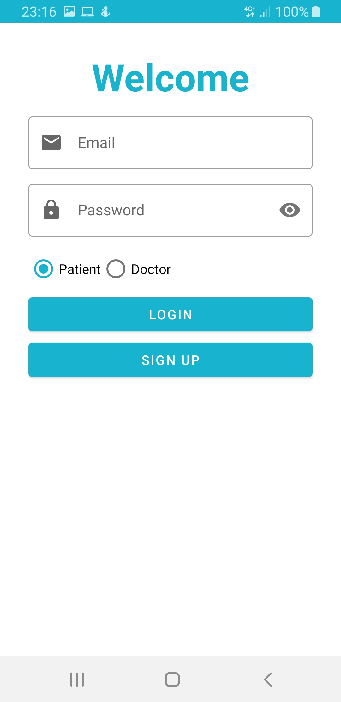
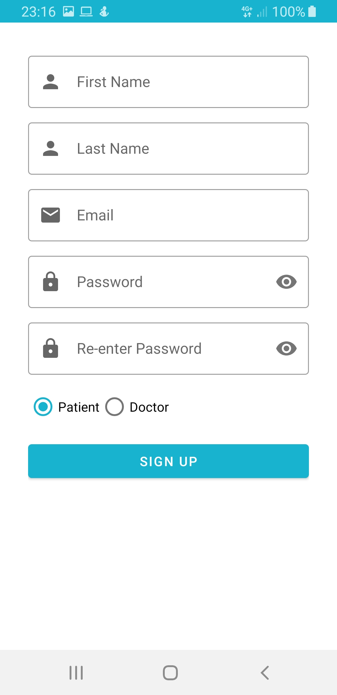
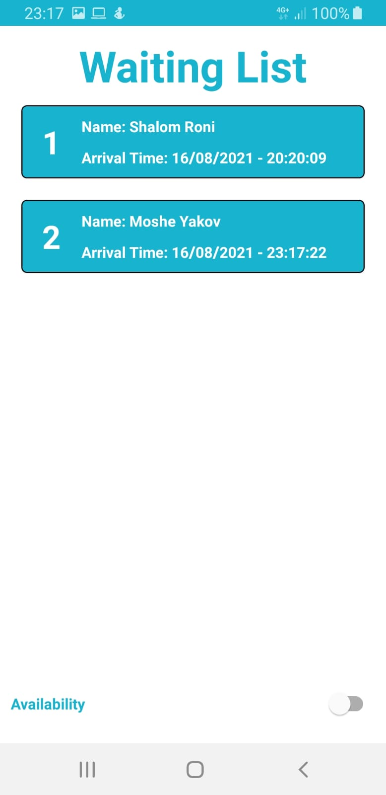
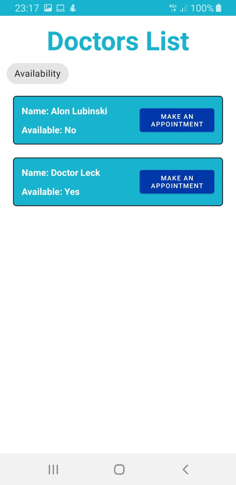
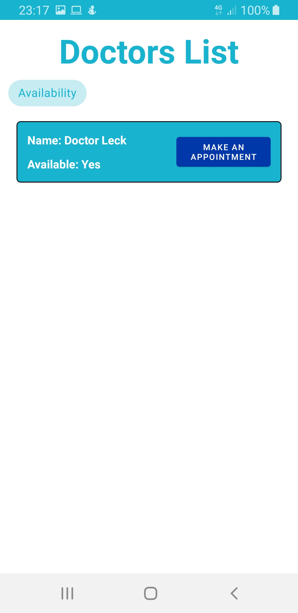
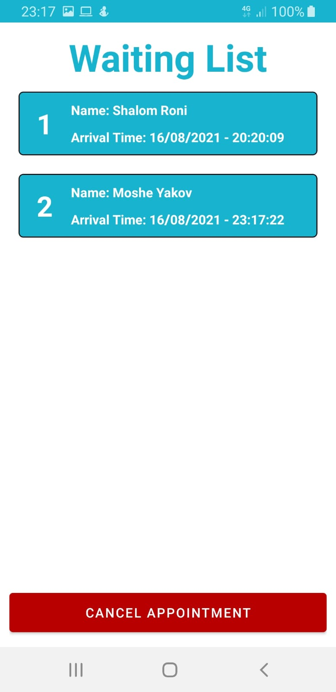

# MoveoApp
Android appointment management app for doctors and patients.

## Screenshots
### Login and Sign Up screens
Authentication was performed using firebase authentication and the personal data was saved using firebase firestore.

 

## Doctor UI
### Doctor Waiting List Screen
A screen that shows patients waiting list with all pending appointments. The appointments are sorted by arrival time (the time they added to firebase).

## Patient UI
### Doctors List Screen
A screen that shows doctors list. There is an option to filter by availability.

 

### Patient Waiting List Screen
A screen that shows patients waiting list with all pending appointments to the same doctor. The appointments are sorted by arrival time (the time they added to firebase). There is an option to cancel an appointment.

